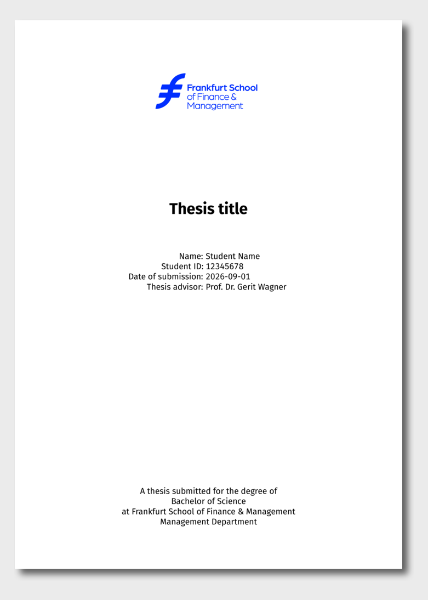

# Frankfurt School Thesis Template

This is a Quarto template that assists you in creating a Frankfurt School thesis. 

## Installation

You can create a thesis based on this template with the following command:

```bash
quarto use template fs-ise/quarto-template-thesis
```

It is recommended to install the template in the same directory (not in a subdirectory).

This will install the extension and create the files that you can use as a starting place for your thesis.

## Use

```bash
quarto preview
quarto render
# Note: direct pdf rendering does not (yet) work: quarto render --to pdf 
```

## Preview

<!--

sudo apt-get install -y imagemagick ghostscript

magick -density 300 "template.pdf[0]" \
  -resize x1000 \
  -bordercolor grey92 -border 25x35 \
  \( +clone -background black -shadow 60x6+10+10 \) \
  +swap -background grey92 -layers merge +repage \
  "template.png"

-->

[](examples/template.pdf)


## Attribution

This template builds on the Quarto thesis template by Rob J. Hyndman and the Monash Quarto team (quarto-monash/thesis), adapted for Frankfurt School theses.
